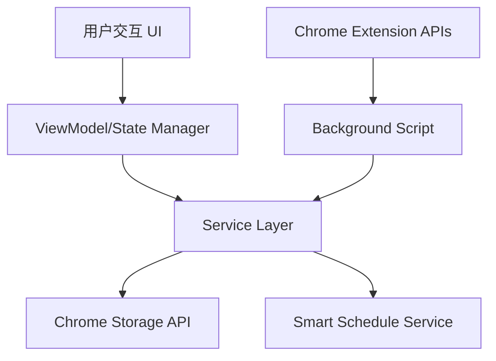

## 产品概述

一个功能完整的 Chrome 浏览器插件每日计划器，专为需要高效管理时间和任务的用户设计，特别是 ADHD 友好型。插件提供任务管理、多视图日历、智能议程生成及离线使用能力，支持在浏览器侧边栏或弹窗中快速访问。

## 核心功能

- **任务管理**: 创建、编辑、删除及标记完成任务，支持任务分类和优先级设置。
- **多视图日历**: 提供周视图和日视图切换，直观展示任务分布与时间安排。
- **智能时间分配**: 基于本地算法根据任务优先级和时长自动生成每日议程，预留外部 AI 接口。
- **ADHD 友好设计**: 界面简洁清晰，提供专注模式、计时提醒及视觉引导。
- **本地存储与离线功能**: 使用 Chrome Storage API 保存数据，确保无网络环境下正常使用。
- **扩展接口**: 预留云端同步 API 接口及外部 AI 智能生成接口。

## 技术栈选择

- **前端框架**: React (Manifest V3 支持)
- **语言**: TypeScript
- **样式**: Tailwind CSS
- **构建工具**: Webpack 或 Vite (配合 CRXJS 或 Plasmo)
- **UI 组件**: shadcn/ui (适配 Tailwind)
- **状态管理**: Zustand 或 React Context API
- **存储**: Chrome Storage API (chrome.storage.local)
- **图标**: React Icons 或 Lucide React

## 架构设计

### 系统架构

采用 MVVM 架构模式，将插件分为 Popup（弹窗界面）、Options（设置页）和 Background（后台服务）三个主要部分。



### 模块划分

- **UI 模块**: 任务列表组件、日历视图组件、设置页面、弹窗入口。
- **状态管理模块**: 管理 Task 数据、View 状态（周/日）、User Preferences。
- **存储服务模块**: 封装 Chrome Storage API，提供 CRUD 及批量操作接口。
- **智能日程服务**: 包含本地启发式算法，用于自动排程任务。

### 数据流

用户操作任务 -> 触发 State 更新 -> 调用 Storage Service 持久化 -> UI 自动重绘。智能排程时，读取任务列表 -> 算法计算 -> 生成时间块 -> 更新任务时间属性 -> 保存。

## 实现细节

### 核心目录结构

```
chrome-daily-planner-extension/
├── public/
│   ├── manifest.json       # 扩展配置文件
│   └── icons/              # 插件图标
├── src/
│   ├── components/         # React 组件 (TaskCard, CalendarView, etc.)
│   ├── pages/              # Popup, Options 页面
│   ├── hooks/              # 自定义 Hooks (useTasks, useCalendar)
│   ├── services/           # 存储、算法服务
│   ├── store/              # Zustand store
│   ├── types/              # TypeScript 定义
│   └── utils/              # 工具函数
├── package.json
└── tsconfig.json
```

### 关键代码结构

**Task 数据接口**:

```typescript
interface Task {
  id: string;
  title: string;
  description?: string;
  priority: 'important_urgent' | 'important_not_urgent' | 'not_important_urgent' | 'not_important_not_urgent';
  status: 'todo' | 'in-progress' | 'done';
  estimatedDuration: number; // minutes
  scheduledStart?: Date;
  scheduledEnd?: Date;
  tags: string[];
  createdAt: Date;
}
```

**存储服务接口**:

```typescript
class StorageService {
  async getTasks(): Promise<Task[]>;
  async saveTask(task: Task): Promise<void>;
  async deleteTask(id: string): Promise<void>;
  async getSettings(): Promise<AppSettings>;
}
```

**智能排程算法逻辑** (本地实现):
基于任务优先级和预估时长，按贪心策略填充空闲时间段。

### 技术实施计划

1. **初始化项目**: 使用 Plasmo 或 CRXJS 搭建 React + TS Chrome 插件脚手架。
2. **构建基础 UI**: 使用 Tailwind CSS 和 shadcn/ui 组件库搭建 Popup 和 Options 页面。
3. **实现状态与存储**: 集成 Zustand 和 Chrome Storage API，实现数据持久化。
4. **开发日历视图**: 实现周/日切换逻辑及时间轴渲染。
5. **实现本地排程算法**: 编写启发式算法自动分配任务时间。

### 集成点

- **Chrome Extension APIs**: `chrome.storage`, `chrome.alarms` (用于提醒)。
- **未来集成**: 预留 `/api/sync` 用于云端同步，预留 `/api/ai-schedule` 用于外部 AI 调用。

## 设计风格

采用干净、专注的 Glassmorphism（玻璃拟态）风格，结合柔和的渐变色和微动效，打造现代感与轻松感并存的界面。针对 ADHD 用户，色彩区分度高，重点信息突出，避免过度干扰。

## 页面规划

1. **Popup 主界面**: 快速添加任务、查看今日概览、紧急任务高亮。
2. **日历视图页 (嵌入)**: 周视图和日视图切换，时间轴展示，拖拽调整任务。
3. **设置页**: 主题切换、通知设置、数据管理（导出/导入）。

## 单页块设计 (Popup)

1. **顶部导航区**: 显示当前日期，视图切换按钮（周/日），设置入口。
2. **任务快速添加栏**: 输入框、优先级选择、添加按钮。
3. **今日任务列表**: 卡片式布局，支持勾选完成、优先级色条标注。
4. **智能建议区**: 显示基于当前时间的待办建议或专注倒计时。

## 交互与响应

- 鼠标悬停任务卡片时显示详细信息和操作按钮。
- 日历视图支持点击时间块创建新任务。
- 添加任务时有流畅的列表插入动画。

## Agent Extensions

### SubAgent

- **code-explorer**
- Purpose: 探索并分析现有 Chrome 插件代码结构（如果存在），或搜索最佳实践库。
- Expected outcome: 明确现有代码结构或确定标准开发模式。